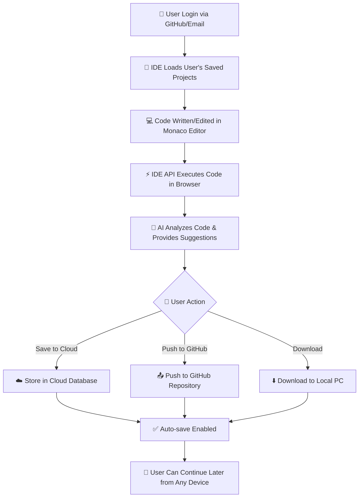

# ☁️ **AI-Based Cloud IDE** `🚧 (Base Version ==> Improved will be uploaded in summar)`

### 🧠 *Intelligent Cloud IDE with AI Code Assistant & GitHub Integration*

*(Powered by APIs of online IDEs & GPT models)*
---


---

<p align="center">
  
  
  
  
  
  
</p>

---

## 🚧 **Project Status**

> This project is currently under **active development**.<br>
> 
> **Core Development Team:**
> - 🧑‍💻 **Ahmad** - Backend & AI Integration | [LinkedIn](https://www.linkedin.com/in/ahmad0763)

---

## 💡 **Overview**

An **AI-powered Cloud IDE** that runs entirely in your browser — **no installation required**.

Traditional code editors require installation on a PC and store files locally. Beginners often lack guidance on writing clean, optimized, well-documented code. **Our solution** eliminates these barriers by providing:

✨ **Browser-based coding** accessible from any device  
🤖 **Real-time AI assistance** for code review, bug detection & optimization  
☁️ **Cloud storage** with auto-save functionality  
🔄 **Direct GitHub integration** for seamless version control  

Users can **write, edit, run, and save code online** with intelligent AI assistance for:

> 🐞 Bug Detection  
> ⚡ Code Optimization  
> 📝 Auto-Generated Documentation  
> 🔄 GitHub Push Integration  
> 💡 Smart Code Suggestions

---

## 🎯 **Core Objectives**

* 🌍 Build a **browser-based IDE** accessible from any device without installation
* ⚙️ Enable **instant coding** without local setup or configuration
* 🤖 Integrate **AI assistant** to review, debug, optimize, and document code automatically
* 🔐 Provide **dual authentication**: GitHub OAuth + Email/Password
* ☁️ Store all projects securely in **cloud workspace** with auto-save
* 📤 **Push projects to GitHub** directly from the IDE
* 📊 Provide **user dashboard** to view, manage, and organize all projects
* 🎨 Deliver **professional editor experience** with syntax highlighting and Monaco Editor

---

## ⚙️ **Technology Stack**

| Layer              | Tools / Frameworks                                         |
| ------------------ | ---------------------------------------------------------- |
| **Frontend**       | HTML, CSS, Bootstrap / Tailwind CSS, JavaScript            |
| **Code Editor**    | Monaco Editor (VS Code's editor engine)                    |
| **Backend**        | Flask (Python Web Framework)                               |
| **AI Engine**      | OpenAI API (GPT-based) / Google Gemini API                 |
| **Authentication** | GitHub OAuth 2.0 + JWT (JSON Web Tokens)                   |
| **Database**       | MySQL / MongoDB                                            |
| **Cloud Storage**  | Cloudinary (Primary) / Firebase / AWS S3                   |
| **IDE API**        | Online IDE API for code execution                          |
| **Git Integration**| GitHub API                                                 |
| **Deployment**     | Render / Railway / AWS / Heroku                            |

---

## ✨ **Key Features**

### 🎯 **Core Features**
- **🌐 Browser-Based IDE**: Write & run code online using API of any online IDE
- **🤖 AI Code Assistant**: 
  - Bug detection & error identification
  - Code optimization suggestions
  - Auto-generated comments
  - README documentation generation
  - Code quality scoring
- **🔐 Dual Authentication**:
  - GitHub OAuth login
  - Email/Password registration & login
- **☁️ Cloud Storage**: 
  - Save projects in user workspace
  - Real-time auto-save
  - Never lose your work
- **📤 GitHub Integration**: 
  - Push code directly to GitHub repositories
  - Create new repos or update existing ones
- **🎨 Professional Editor**:
  - Monaco Editor (same as VS Code)
  - Syntax highlighting
  - Code formatting
  - Multi-language support
- **📊 User Dashboard**: 
  - View all projects
  - Open, edit, delete files
  - Project management interface

---

## 🧩 **System Architecture**

### **Major Modules**

| Module                    | Description                                                              |
| ------------------------- | ------------------------------------------------------------------------ |
| 🔐 **Authentication**     | GitHub OAuth + JWT-based Email authentication                            |
| 💻 **Cloud IDE**          | Monaco Editor with syntax highlighting, code formatting, file explorer   |
| 🧠 **AI Code Assistant**  | Detects errors, optimizes code, generates comments & README              |
| 💾 **Cloud Storage**      | Auto-save functionality, load files on login, project management         |
| 🌐 **GitHub Integration** | Connect GitHub account, push to new/existing repos                       |
| 📊 **Dashboard**          | User interface to manage, view, and organize all projects                |

---

## 🔄 **System Workflow**



---

## 🛠️ **Project Structure**

```
ai-cloud-ide/
├── app/
│   ├── models/          # Database models (User, Project, File)
│   ├── routes/          # API endpoints (auth, files, AI, GitHub)
│   ├── services/        # Business logic (AI, GitHub, Storage)
│   ├── static/          # Frontend assets (CSS, JS, images)
│   ├── templates/       # HTML templates
│   └── config.py        # Configuration
├── tests/               # Unit & integration tests
├── migrations/          # Database migrations
├── .env                 # Environment variables
├── requirements.txt     # Python dependencies
├── run.py               # Application entry point
└── README.md
```

---

## 🚀 **API Endpoints**

| Method | Endpoint            | Description                    |
| ------ | ------------------- | ------------------------------ |
| POST   | `/auth/github`      | GitHub OAuth login             |
| POST   | `/auth/register`    | Email registration             |
| POST   | `/auth/login`       | Email login                    |
| POST   | `/file/save`        | Save code to cloud             |
| GET    | `/file/load`        | Load saved code                |
| DELETE | `/file/delete`      | Delete a file                  |
| POST   | `/ai/review`        | AI code review & suggestions   |
| POST   | `/github/push`      | Push code to GitHub            |
| GET    | `/dashboard/projects` | Get all user projects        |

---

## 🤖 **AI Processing Logic**

1. **Read code** from Monaco Editor (powered by online IDE API)
2. **Detect programming language** automatically
3. **Send to AI** with prompt:
   - Find syntax errors & bugs
   - Suggest optimizations
   - Add code comments
   - Generate README documentation
4. **Display results** in IDE panel with:
   - Issues found
   - Suggested fixes
   - Generated documentation
   - Code quality score

---

## 🔮 **Future Enhancements**

✨ *Planned Features...*

* 🧑‍🤝‍🧑 **Real-time Team Collaboration**: Multiple users editing the same file simultaneously
* 🎙️ **Voice-to-Code AI**: Write code using speech recognition
* 🐍 **Extended Language Support**: C#, Java, PHP, Rust, Go
* 🪲 **Live Debugging**: Step-by-step code execution with breakpoints
* 🧰 **AI Auto-Refactor Mode**: One-click intelligent code improvement
* 🎨 **Custom Themes**: Personalized IDE color schemes
* 📊 **Code Analytics**: Track coding patterns and productivity
* 🔌 **Plugin System**: Extend IDE with custom extensions

---

## 📊 **Database Design**

### Tables Schema

**users**
```sql
id, name, email, github_id, password_hash, created_at
```

**projects**
```sql
id, user_id, project_name, description, created_at, updated_at
```

**files**
```sql
id, project_id, filename, content, language, last_updated
```

---

## 🧪 **Testing Strategy**

- ✅ Authentication flow (GitHub OAuth + Email)
- ✅ File operations (Save, Load, Delete)
- ✅ AI response formatting
- ✅ GitHub push functionality
- ✅ Cloud storage reliability
- ✅ Browser compatibility (Chrome, Firefox, Safari, Edge)
- ✅ Real-time auto-save mechanism

---

## 📈 **Expected Results**

* ✅ Users can code from any browser without installation
* ✅ AI improves code quality in real-time
* ✅ All files remain safe in cloud storage
* ✅ Projects accessible from any device
* ✅ Beginner-friendly with professional capabilities
* ✅ Seamless GitHub integration for version control

---

## 🧾 **Documentation**

📄 Comprehensive project documentation available at:  
[Project Documentation](Document.docx)

For detailed setup instructions, API documentation, and developer guides, please refer to the documentation file.

---

## 👥 **Development Team**

<table>
  <tr>
    <td align="center">
      <br>
      <b>Ahmad</b><br>
      <sub>Backend & AI Integration</sub><br>
      <a href="https://www.linkedin.com/in/ahmad0763">LinkedIn</a>
    </td>
  </tr>
</table>

---

## 🤝 **Contributing**

🧩 We welcome contributions, feature ideas, and feedback once the project goes public!

👉 **Star ⭐ this repository** to get notified about development updates!

### How to Contribute (Coming Soon)
1. Fork the repository
2. Create your feature branch (`git checkout -b feature/AmazingFeature`)
3. Commit your changes (`git commit -m 'Add some AmazingFeature'`)
4. Push to the branch (`git push origin feature/AmazingFeature`)
5. Open a Pull Request

<p align="center">
  <a href="#"></a>
  <a href="#"></a>
</p>

---

## 📧 **Contact**

For questions, suggestions, or collaboration opportunities:

<p align="center">
  <a href="https://www.linkedin.com/in/ahmad0763">
    
  </a>
  <a href="#">
    
  </a>
  <a href="#">
    
  </a>
</p>

---

## 📜 **License**

This project is licensed under the **MIT License** — open for innovation, learning, and collaboration.

See [LICENSE](License.md) for more details.

<p align="center">
  <a href="#"></a>
</p>

---

## 🌟 **Acknowledgments**

Special thanks to:
- **Monaco Editor** team for the amazing code editor
- **OpenAI** for GPT API powering our AI assistant
- **GitHub** for their comprehensive API
- The open-source community for inspiration

---

<p align="center">
  <b>🚀 Bringing intelligent cloud coding to life!</b><br>
  <sub>Combining the power of VS Code, GitHub, and ChatGPT in one platform</sub>
</p>

<p align="center">
  Made with ❤️ by the AI Cloud IDE Team
</p>

---

<p align="center">
  
  
  
</p>
