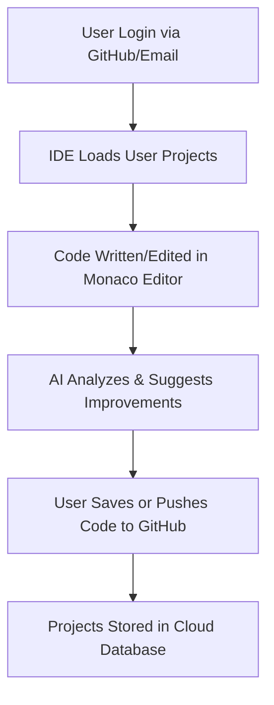

# ☁️ **AI-Based Cloud IDE** `🚧 (Under Development)`

### 🧠 *Intelligent Cloud IDE with AI Code Assistant & GitHub Integration*

*(Powered by APIs of online IDEs & GPT models)*

---

  
  
  
  
  

---

## 🚧 **Project Status**

> This project is currently under **active development**.
> Developed and maintained by **Ahmad** 🧑‍💻
> Other Developer are Disclosed Soon 👥
---

## 💡 **Overview**

An **AI-powered Cloud IDE** that runs entirely in your browser — no installation required.
Users can **write, edit, run, and save code online** with real-time AI assistance for:

> 🐞 Bug detection  ⚡ Optimization  🧾 Auto Docs  🔄 GitHub Integration

---

## 🎯 **Core Objectives**

* 🌍 Build a **browser-based IDE** accessible from any device
* ⚙️ Enable **coding without local setup or installation**
* 🤖 Add an **AI assistant** to analyze, debug, and improve code
* 🔐 Provide **GitHub & Email authentication**
* ☁️ Store all code securely in a **cloud workspace**

---

## ⚙️ **Technology Stack**

| Layer              | Tools / Frameworks                                         |
| ------------------ | ---------------------------------------------------------- |
| **Frontend**       | HTML, CSS, Bootstrap / Tailwind, JavaScript, Monaco Editor |
| **Backend**        | Flask                                                      |
| **AI Engine**      | GPT-based Model (OpenAI or Gemeni API)                     |
| **Authentication** | GitHub OAuth + JWT                                         |
| **Database**       | MySQL / MongoDB                                            |
| **Cloud Storage**  | Firebase / AWS S3 / Cloudinary(Primarly)                   |

---

## 🧩 **Key Modules**

| Module                    | Description                                                |
| ------------------------- | ---------------------------------------------------------- |
| 🔐 **Authentication**     | GitHub OAuth + Email Sign-In                               |
| 🧠 **AI Code Assistant**  | Detects bugs, optimizes, generates comments & docs         |
| 💾 **Cloud Storage**      | Auto-save, load, manage project files                      |
| 🌐 **GitHub Integration** | Push code directly from IDE                                |
| 💻 **Online IDE**         | Monaco Editor with syntax highlighting & real-time editing |

---

## 🔮 **Planned Enhancements**

✨ *Coming Soon...*

* 🧑‍🤝‍🧑 Real-time **team collaboration**
* 🎙️ **Voice-to-Code AI** support
* 🐍 Multi-language support — *C#, Java, PHP, Rust*
* 🪲 **Live debugging** (step-by-step execution)
* 🧰 **One-click AI refactor mode**

---

## 🧱 **System Flow**

---

## 🧾 **Documentation Source**

📄 Based on official documentation:
**`AI_Cloud_IDE_Documentation.docx`**

---

## 👤 **Developer**

> 🧑‍💻 **Developer:** [Ahmad](https://www.linkedin.com/in/ahmad0763)
> Backend & AI Integration | System Design | API Integration
> *Bringing intelligent cloud coding to life 🚀*

  
  

---

## ⭐ **Contributing**

🧩 Contributions, feature ideas, and feedback are always welcome (once public).
👉 **Watch the repo** and **star it** to get notified when development updates drop!

  
  

---

## 🪶 **License**

📜 This project is licensed under the **MIT License** — open for innovation & learning.

  

